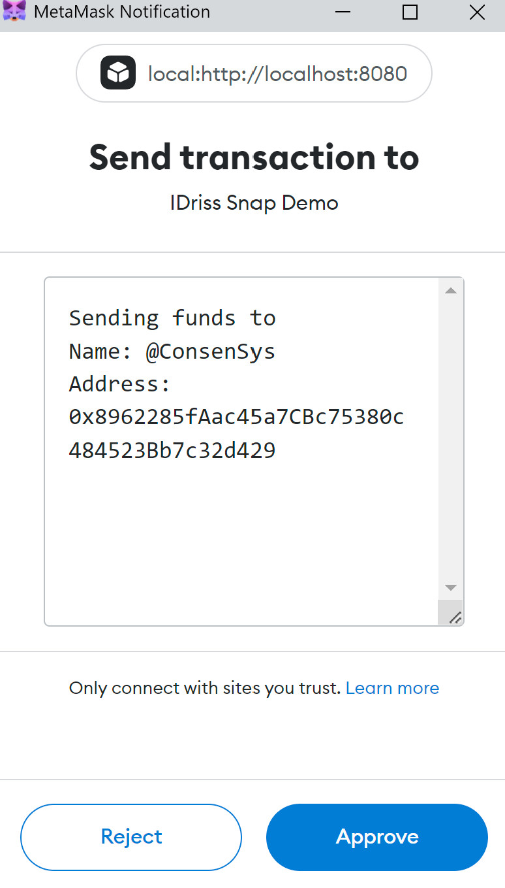

# Multi Resolver

This submission showcases a multi-resolver MetaMask Snap.
It enables dApps to send transactions to string-type handles that can take on a
multitude of origins.
Instead of integrating multiple domain services and resolvers individually,
dApps can now simply call this snap and let MetaMask do the rest.

dApps can interact with the snap by calling

```javascript
const resolveInput = async (identifier?: string) => {
  return await window.ethereum.request({
    method: 'wallet_invokeSnap',
    params: [
      defaultSnapOrigin,
      {
        method: 'resolve_send',
        identifier: identifier,
      },
    ],
  });
};
```

Which invokes the resolving process in MetaMask. The user is presented with the result of the resolver and can either accept or decline sending funds to the person defined through *identifier*.

<p style="text-align: center; width: 50%">

</p>

## Usage

To install, run:

```bash
yarn
yarn install
```

To run the snap, run:

```bash
yarn build
yarn start
```


## Snaps is pre-release software

To interact with this Snap, you will need to install the [MetaMask Flask Bogota Build](https://output.circle-artifacts.com/output/job/ac54c30a-c43c-4004-9998-219d3b298fce/artifacts/0/builds-flask/metamask-flask-chrome-10.20.0-flask.0.zip).


## Notes

- I will use this snap to continuously experiment with new functionalities.
It should also provide a playground for other (open-source) developers to add more custom resolvers to MetaMask.
This will improve the usability of web3 for both users who now can natively send transactions to Twitter usernames, emails, phone numbers, ens & UD domains, lens protocol handles and whatever else other people come up with, as well as for dApp builders, who don't have to worry about what resolvers they should integrate anymore.
- When adding more resolvers, one should keep naming conflicts in mind. Even though I am not aware of any conflicts, a system for determining a resolver priority list should be developed. For the beginning, I am proposing a popularity ranking, which simply takes the size of an ecosystem into consideration .
